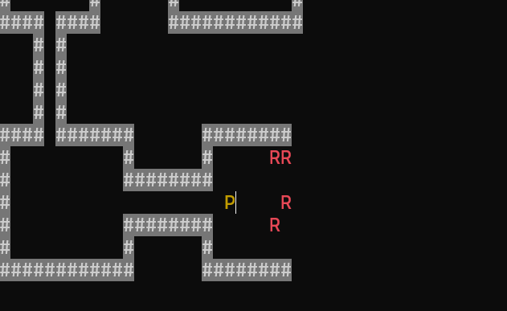
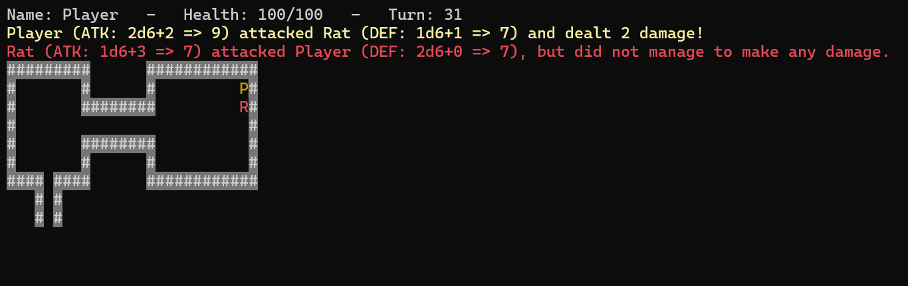
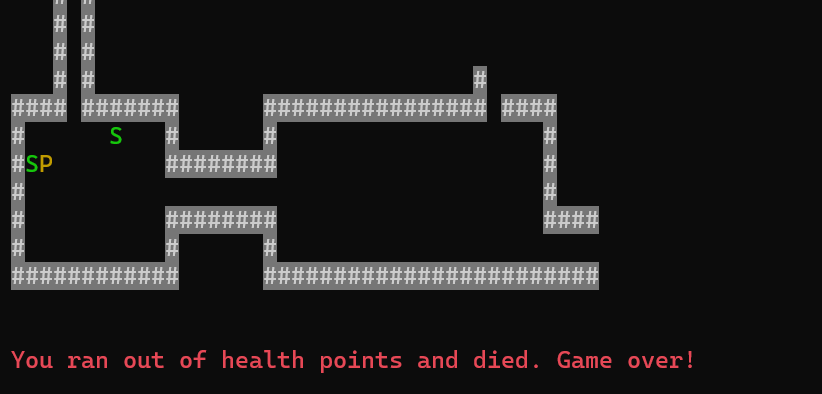
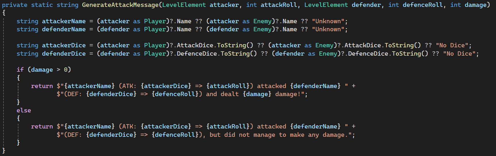
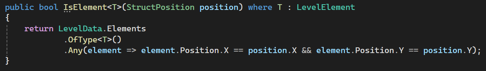
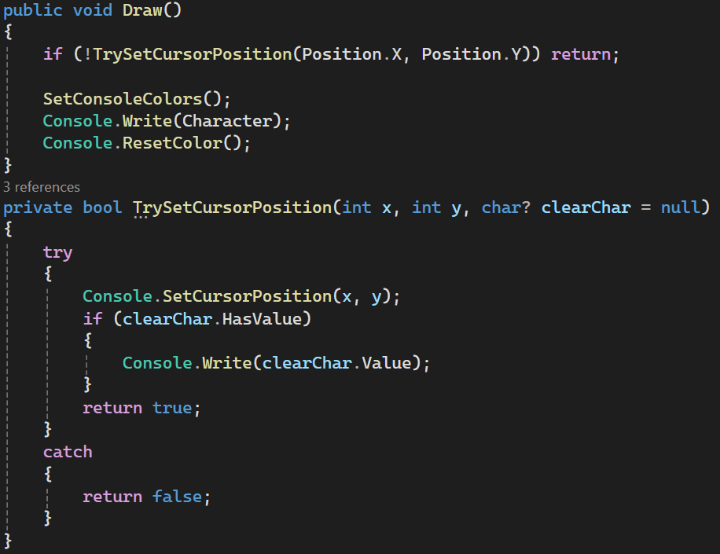

# Labb2

This is my second assignment for my .NET studies at IT-Högskolan. Assignment submitted in oktober 2024.

## Critera for the assignment

This project implements a simplified dungeon crawler game as a console application. Players explore maze-like dungeons, encountering enemies and searching for treasures.

Key Features:

* Level Design: A predefined dungeon layout is read from a text file, creating walls, players, and enemies (rats and snakes).
* Class Hierarchy: Utilizes an abstract base class LevelElement with subclasses for walls and enemies, facilitating code reuse.
* Game Loop: Continuously processes player and enemy actions based on user input, handling movement, attacks, and combat mechanics.
* Visibility Range: Limits the player's view to a radius of 5 units while keeping walls visible once encountered.

* Dice Mechanics: Simulates dice rolls for attack and defense, allowing players and enemies to deal damage based on dice configurations.

* Movement Patterns: The player moves based on input; rats move randomly, and snakes move away from the player if within a certain range.

This project focuses on object-oriented programming principles, avoiding procedural generation for level design.

## Structure for my program

In this dungeon crawler project, I implemented several programming concepts to enhance functionality and maintainability. I utilized structs to efficiently manage the positions of various game elements, allowing for straightforward calculations and updates.

Key Implementations:

* Lambda Expressions & Delegates: Incorporated lambda expressions and delegates to streamline event handling and reduce boilerplate code, making the codebase more modular and easier to read.
* Polymorphism: Leveraged polymorphism through abstract classes and interfaces, allowing for dynamic method resolution and more flexible interactions between different game elements.

* LINQ: Used LINQ for querying and filtering game elements, which simplified operations like detecting collisions and managing lists of active characters.

* Game Logic: Developed custom methods for handling movement, attack calculations, and updating game states, ensuring a responsive and engaging gameplay experience.
* Error Handling: Implemented error handling to manage invalid inputs and ensure smooth gameplay, enhancing user experience.

These design choices contributed to a robust and organized code structure, making the project not only functional but also scalable for future enhancements.

